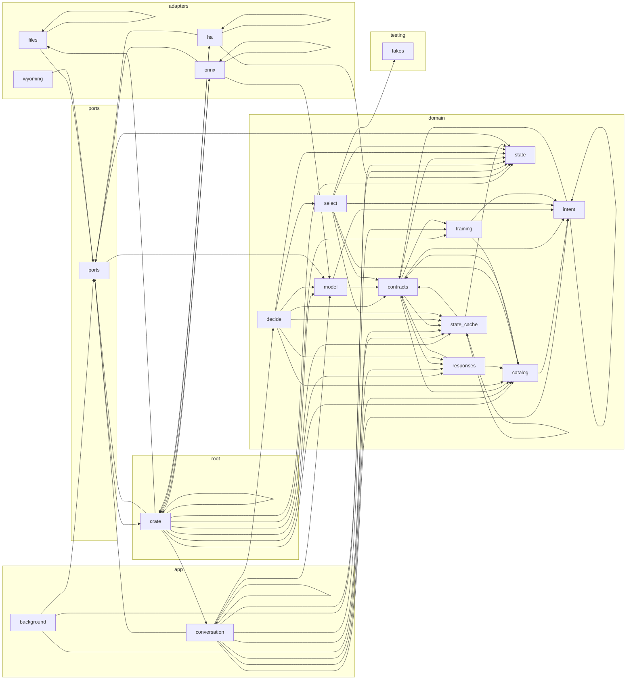

# Architecture

The pre-commit hook writes this file from the module graph.

```mermaid
flowchart LR
    subgraph adapters
        crate_adapters_files[files]
        crate_adapters_ha[ha]
        crate_adapters_onnx[onnx]
        crate_adapters_wyoming[wyoming]
    end
    subgraph app
        crate_app_background[background]
        crate_app_conversation[conversation]
    end
    subgraph domain
        crate_domain_catalog[catalog]
        crate_domain_contracts[contracts]
        crate_domain_decide[decide]
        crate_domain_intent[intent]
        crate_domain_model[model]
        crate_domain_responses[responses]
        crate_domain_select[select]
        crate_domain_state[state]
        crate_domain_state_cache[state_cache]
        crate_domain_training[training]
    end
    subgraph ports
        crate_ports[ports]
    end
    subgraph root
        crate[crate]
    end
    subgraph testing
        crate_testing_fakes[fakes]
    end
    crate --> crate
    crate --> crate_adapters_files
    crate --> crate_adapters_ha
    crate --> crate_adapters_onnx
    crate --> crate_app_conversation
    crate --> crate_domain_catalog
    crate --> crate_domain_model
    crate --> crate_domain_responses
    crate --> crate_domain_state
    crate --> crate_domain_state_cache
    crate --> crate_domain_training
    crate --> crate_ports
    crate_adapters_files --> crate_adapters_files
    crate_adapters_files --> crate_ports
    crate_adapters_ha --> crate
    crate_adapters_ha --> crate_adapters_ha
    crate_adapters_ha --> crate_domain_state
    crate_adapters_ha --> crate_ports
    crate_adapters_onnx --> crate
    crate_adapters_onnx --> crate_adapters_onnx
    crate_adapters_onnx --> crate_domain_model
    crate_adapters_onnx --> crate_ports
    crate_adapters_wyoming --> crate_ports
    crate_app_background --> crate_domain_state
    crate_app_background --> crate_domain_state_cache
    crate_app_background --> crate_ports
    crate_app_conversation --> crate_app_conversation
    crate_app_conversation --> crate_domain_catalog
    crate_app_conversation --> crate_domain_decide
    crate_app_conversation --> crate_domain_intent
    crate_app_conversation --> crate_domain_model
    crate_app_conversation --> crate_domain_responses
    crate_app_conversation --> crate_domain_state
    crate_app_conversation --> crate_domain_state_cache
    crate_app_conversation --> crate_domain_training
    crate_app_conversation --> crate_ports
    crate_domain_catalog --> crate_domain_contracts
    crate_domain_catalog --> crate_domain_intent
    crate_domain_contracts --> crate_domain_catalog
    crate_domain_contracts --> crate_domain_intent
    crate_domain_contracts --> crate_domain_responses
    crate_domain_contracts --> crate_domain_state
    crate_domain_contracts --> crate_domain_state_cache
    crate_domain_contracts --> crate_domain_training
    crate_domain_decide --> crate_domain_catalog
    crate_domain_decide --> crate_domain_contracts
    crate_domain_decide --> crate_domain_model
    crate_domain_decide --> crate_domain_responses
    crate_domain_decide --> crate_domain_select
    crate_domain_decide --> crate_domain_state
    crate_domain_decide --> crate_domain_state_cache
    crate_domain_intent --> crate_domain_contracts
    crate_domain_intent --> crate_domain_intent
    crate_domain_model --> crate_domain_contracts
    crate_domain_model --> crate_domain_intent
    crate_domain_responses --> crate_domain_catalog
    crate_domain_responses --> crate_domain_contracts
    crate_domain_select --> crate_domain_catalog
    crate_domain_select --> crate_domain_contracts
    crate_domain_select --> crate_domain_intent
    crate_domain_select --> crate_domain_state
    crate_domain_select --> crate_domain_state_cache
    crate_domain_select --> crate_testing_fakes
    crate_domain_state_cache --> crate_domain_contracts
    crate_domain_state_cache --> crate_domain_state
    crate_domain_state_cache --> crate_domain_state_cache
    crate_domain_training --> crate_domain_catalog
    crate_domain_training --> crate_domain_intent
    crate_ports --> crate
    crate_ports --> crate_domain_model
    crate_ports --> crate_domain_state
```
